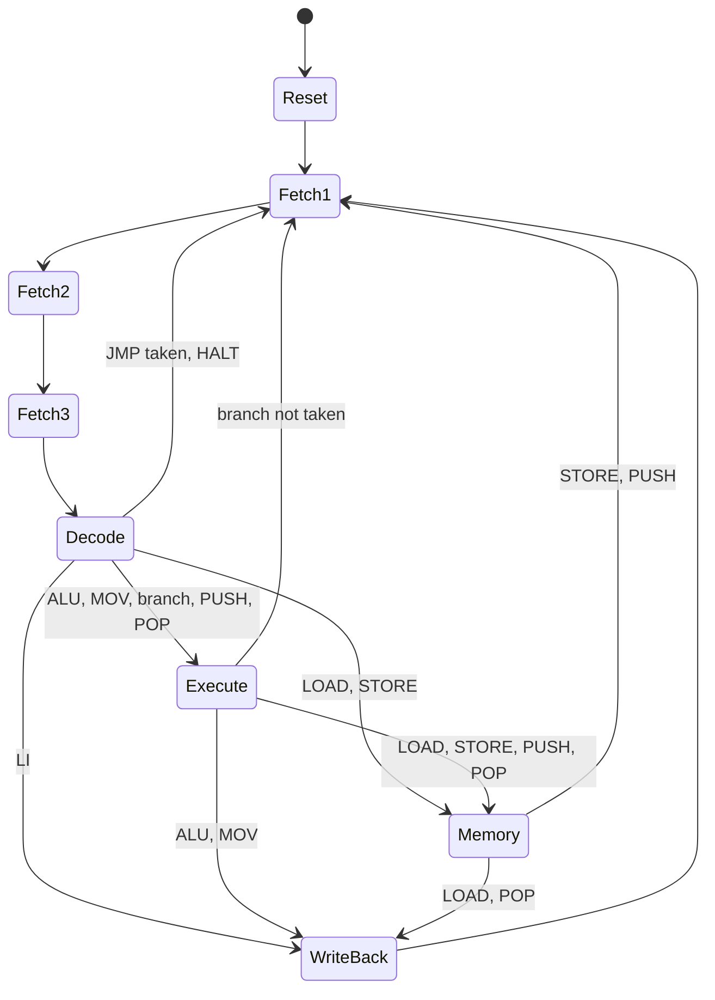

# 16-Bit Minicomputer — ISA, ALU, and Microcode Reference

Academic 16-bit Von Neumann CPU implemented in Logisim-evolution. This document defines the instruction set, ALU operation codes, processor FSM states, control-signal encoding, and the mapping from **macro-instructions** to **micro-instruction cycles**.

---

## Table of Contents

1. [Architecture Summary](#1-architecture-summary)
2. [Instruction Formats](#2-instruction-formats)
3. [Register File](#3-register-file)
4. [ALU Operations and Flags](#4-alu-operations-and-flags)
5. [Instruction Set (Opcodes)](#5-instruction-set-opcodes)
6. [Processor FSM States](#6-processor-fsm-states)
7. [Control Unit Organization](#7-control-unit-organization)
8. [Control Signal Encoding (14-bit Microcode Word)](#8-control-signal-encoding-14-bit-microcode-word)
9. [Datapath Multiplexers](#9-datapath-multiplexers)
10. [Instruction → Micro-instruction Sequences](#10-instruction--micro-instruction-sequences)
11. [Control ROM Tables](#11-control-rom-tables)
12. [Assembly Syntax and Examples](#12-assembly-syntax-and-examples)
13. [Design Notes and Limitations](#13-design-notes-and-limitations)

---

## 1. Architecture Summary

| Property                  | Value                                   |
| ------------------------- | --------------------------------------- |
| Word size                 | 16 bits                                 |
| Address size              | 16 bits                                 |
| Memory model              | Single unified RAM (Von Neumann)        |
| Internal bus              | 16 bits                                 |
| General-purpose registers | 8 (`R0`–`R7`)                           |
| Special registers         | `PC`, `IR`, `MAR`, `MDR`, `SP`, `FLAGS` |
| Immediate field           | 9 bits, sign-extended to 16 bits        |
| ALU width                 | 16 bits                                 |
| Control implementation    | Moore FSM + dual ROM decoder            |

### Datapath Components

```txt
┌─────────────┐     ┌──────────────────┐     ┌──────────┐
│ Control Unit│────▶│ Register File    │────▶│    ALU   │
│ (FSM + ROM) │     │ R0–R7            │     │  16-bit  │
└──────┬──────┘     └────────┬─────────┘     └─────┬────┘
       │                     │                     │
       │              ┌──────┴──────┐              │
       │              │  16-bit Bus │◀─────────────┘
       │              └──┬───┬───┬───┘
       │                 │   │   │
       ▼                 ▼   ▼   ▼
   Immediate Gen        PC  MAR MDR ──▶ RAM
```

There is **no operating-system call interface** (no `SYSCALL`, `TRAP`, or privileged mode).

---

## 2. Instruction Formats

All instructions are exactly **one 16-bit word**.

### Format R — Register / ALU

Used for register-to-register operations, memory access with a base register, and stack operations.

```txt
 15  14  13  12 │  11  10   9 │  8   7   6  │  5   4   3  │  2   1   0
┌───────────────┼─────────────┼─────────────┼─────────────┼─────────────┐
│    OPCODE     │      RD     │     RS1     │     RS2     │   ALUCODE   │
│   (4 bits)    │   (3 bits)  │  (3 bits)   │  (3 bits)   │  (3 bits)   │
└───────────────┴─────────────┴─────────────┴─────────────┴─────────────┘
```

| Field     | Bits  | Description                                        |
| --------- | ----- | -------------------------------------------------- |
| `OPCODE`  | 15–12 | Instruction identifier                             |
| `RD`      | 11–9  | Destination register (`R0`–`R7`)                   |
| `RS1`     | 8–6   | First source register                              |
| `RS2`     | 5–3   | Second source register                             |
| `ALUCODE` | 2–0   | ALU operation (see §4); ignored by non-ALU opcodes |

### Format I — Immediate

Used for loading constants, absolute addressing, and branches.

```txt
 15  14  13  12 │ 11  10   9  │  8   7   6   5   4   3   2   1   0
┌───────────────┼─────────────┼─────────────────────────────────────┐
│    OPCODE     │     RD      │               IMMEDIATE             │
│    (4 bits)   │   (3 bits)  │               (9 bits)              │
└───────────────┴─────────────┴─────────────────────────────────────┘
```

| Field    | Bits  | Description                                      |
| -------- | ----- | ------------------------------------------------ |
| `OPCODE` | 15–12 | Instruction identifier                           |
| `RD`     | 11–9  | Destination register or branch condition context |
| `IMM9`   | 8–0   | Signed immediate                                 |

### Immediate Generator (9 → 16 bits)

```js
imm16 = { {7{IMM9[8]}}, IMM9[8:0] }   // arithmetic / branch sign extension
```

For **unsigned address loads** (`LIA`), software convention treats the 9-bit field
as zero-extended by first loading with `LI` and masking, or by storing addresses
in the upper portion of a word using `LIA` with positive values only (0–511).

For **string / byte data**, programs store character codes as immediate values with `LI` (one character per instruction, 9-bit signed range −256…+255) or load null-terminated strings from RAM with `LOAD`.

---

## 3. Register File

| Name | ID (3-bit) | Role                                                                                             |
| ---- | ---------- | ------------------------------------------------------------------------------------------------ |
| `R0` | `000`      | General purpose; **hard-wired zero** for reads (writes ignored or undefined — do not write `R0`) |
| `R1` | `001`      | General purpose                                                                                  |
| `R2` | `010`      | General purpose                                                                                  |
| `R3` | `011`      | General purpose                                                                                  |
| `R4` | `100`      | General purpose                                                                                  |
| `R5` | `101`      | General purpose                                                                                  |
| `R6` | `110`      | General purpose / frame pointer (software convention)                                            |
| `R7` | `111`      | General purpose / link register (software convention)                                            |

### Special Registers (outside the 8-register bank)

| Register | Purpose                                                                  |
| -------- | ------------------------------------------------------------------------ |
| `PC`     | Program counter — address of the next instruction to fetch               |
| `IR`     | Instruction register — holds the current instruction                     |
| `MAR`    | Memory address register — drives the RAM address bus                     |
| `MDR`    | Memory data register — holds data read from or to be written to RAM      |
| `SP`     | Stack pointer — points to the top of the hardware stack (grows downward) |
| `FLAGS`  | Condition flags `{V, C, N, Z}` (see §4)                                  |

---

## 4. ALU Operations and Flags

### ALUCODE Table

The 3-bit `ALUCODE` field (bits 2–0 in Format R) selects the ALU operation. Opcode `0001` (`ALU`) always uses this field. Other instructions may hard-wire a specific ALUCODE inside the control ROM.

| ALUCODE | Code (binary) | Operation      | Result                                          |
| ------- | ------------- | -------------- | ----------------------------------------------- |
| `ADD`   | `000`         | Addition       | `RD = RS1 + RS2`                                |
| `SUB`   | `001`         | Subtraction    | `RD = RS1 − RS2`                                |
| `MUL`   | `010`         | Multiplication | `RD = (RS1 × RS2) mod 2¹⁶` (low 16 bits)        |
| `DIV`   | `011`         | Division       | `RD = RS1 ÷ RS2` (unsigned); `Res2` = remainder |
| `OR`    | `100`         | Bitwise OR     | `RD = RS1 \| RS2`                               |
| `AND`   | `101`         | Bitwise AND    | `RD = RS1 & RS2`                                |
| `SHR`   | `110`         | Shift right    | `RD = RS1 >> RS2[3:0]` (logical)                |
| `SHL`   | `111`         | Shift left     | `RD = RS1 << RS2[3:0]`                          |

> **Note:** `DIV` uses the ALU's second result port (`Res2`) for the remainder. The ISA exposes only `RD` through the register write-back path; remainder access requires a future extension or software division.

### FLAGS Register

| Bit | Flag | Name     | Set when                                                                          |
| --- | ---- | -------- | --------------------------------------------------------------------------------- |
| 3   | `V`  | Overflow | Signed overflow on `ADD`/`SUB`                                                    |
| 2   | `C`  | Carry    | Unsigned carry out on `ADD`; borrow on `SUB`; last bit shifted out on `SHR`/`SHL` |
| 1   | `N`  | Negative | Result bit 15 is 1                                                                |
| 0   | `Z`  | Zero     | Result is `0x0000`                                                                |

`FLAGS` are updated after every ALU operation executed in the **Execute** state. Load/store and move operations do **not** modify flags unless they pass through the ALU (e.g., `ADD` for address calculation).

---

## 5. Instruction Set (Opcodes)

4-bit opcode space — 16 macro-instructions.

| Opcode | Binary | Mnemonic | Format | Description                                                      |
| ------ | ------ | -------- | ------ | ---------------------------------------------------------------- |
| `0x0`  | `0000` | `NOOP`   | —      | No operation                                                     |
| `0x1`  | `0001` | `ALU`    | R      | `RD ← RS1 ALUCODE RS2`; updates `FLAGS`                          |
| `0x2`  | `0010` | `LI`     | I      | `RD ← sign_extend(IMM9)`                                         |
| `0x3`  | `0011` | `MOV`    | R      | `RD ← RS1` (microcoded as `ADD RS1, R0`)                         |
| `0x4`  | `0100` | `LOAD`   | R / I  | **R:** `RD ← MEM[RS1]` · **I:** `RD ← MEM[zero_extend(IMM9)]`    |
| `0x5`  | `0101` | `STORE`  | R / I  | **R:** `MEM[RS2] ← RS1` · **I:** `MEM[zero_extend(IMM9)] ← RS1`  |
| `0x6`  | `0110` | `PUSH`   | R      | `MEM[SP] ← RS1`; `SP ← SP − 1`                                   |
| `0x7`  | `0111` | `POP`    | R      | `SP ← SP + 1`; `RD ← MEM[SP]`                                    |
| `0x8`  | `1000` | `JMP`    | I      | `PC ← zero_extend(IMM9)` (absolute jump)                         |
| `0x9`  | `1001` | `BEQ`    | I      | If `Z=1`: `PC ← PC + sign_extend(IMM9)`                          |
| `0xA`  | `1010` | `BNE`    | I      | If `Z=0`: `PC ← PC + sign_extend(IMM9)`                          |
| `0xB`  | `1011` | `BLT`    | I      | If `N=1`: `PC ← PC + sign_extend(IMM9)`                          |
| `0xC`  | `1100` | `BGE`    | I      | If `N=0`: `PC ← PC + sign_extend(IMM9)`                          |
| `0xD`  | `1101` | `BMI`    | I      | If `N=1`: `PC ← PC + sign_extend(IMM9)` (alias of signed branch) |
| `0xE`  | `1110` | `BPL`    | I      | If `N=0`: `PC ← PC + sign_extend(IMM9)`                          |
| `0xF`  | `1111` | `HALT`   | —      | Assert `freeze`; stop fetching                                   |

### Instruction Semantics Detail

#### `NOOP` (`0000`)

No register, memory, or PC change. Consumes one full fetch-decode cycle.

#### `ALU` (`0001`, Format R)

```
RD ← RS1 op RS2    where op = ALUCODE
FLAGS ← ALU flags
```

#### `LI` (`0010`, Format I)

```
RD ← SignExtend(IMM9)
```

Use to load small integers, ASCII characters (e.g. `LI R1, #65` for `'A'`), or as the low part of an address.

#### `MOV` (`0011`, Format R)

```
RD ← RS1
```

Implemented as `ALU ADD RS1, R0` internally; does not update flags (control ROM forces flag-inhibit on writeback path).

#### `LOAD` (`0100`)

- **Format R** (`RS2` and `ALUCODE` ignored): `RD ← MEM[RS1]`
- **Format I**: `RD ← MEM[zero_extend(IMM9)]` — absolute load from addresses `0x0000`–`0x01FF`

#### `STORE` (`0101`)

- **Format R**: `MEM[RS2] ← RS1` (address in `RS2`, data in `RS1`)
- **Format I**: `MEM[zero_extend(IMM9)] ← RS1`

#### `PUSH` (`0110`, Format R)

```
MEM[SP] ← RS1
SP ← SP − 1
```

Stack grows toward lower addresses. `SP` must be initialized before first `PUSH` (e.g. `LI R5, #0xFFFF` / `MOV SP, R5` via control path).

#### `POP` (`0111`, Format R)

```
SP ← SP + 1
RD ← MEM[SP]
```

#### `JMP` (`1000`, Format I)

```
PC ← zero_extend(IMM9)
```

Unconditional jump to absolute address in the low 9-bit range. For wider addresses, use register-indirect jump via `MOV PC, Rs` (requires microcode extension) or compose with high bits in a register.

#### Conditional Branches (`1001`–`1110`, Format I)

```
if condition(FLAGS):  PC ← PC + sign_extend(IMM9)
else:                 PC ← PC + 1   (already advanced in Fetch3)
```

PC-relative offset from the **next** instruction address. The `RD` field is unused (`000`).

#### `HALT` (`1111`)

Stops the clocked FSM (`freeze = 1`). Requires external reset to restart.

---

## 6. Processor FSM States

The control unit implements an 8-state Moore machine. Control signals depend **only** on the current state (via `controlROM`). State transitions depend on **current state + opcode + FLAGS** (via `stateROM`).

| State       | FSM Code (3-bit) | Binary | Description                                              |
| ----------- | ---------------- | ------ | -------------------------------------------------------- |
| `Reset`     | `0`              | `000`  | Initialize PC/SP; clear registers; next → `Fetch1`       |
| `Fetch1`    | `1`              | `001`  | `MAR ← PC`                                               |
| `Fetch2`    | `2`              | `010`  | `MDR ← MEM[MAR]` (instruction fetch)                     |
| `Fetch3`    | `3`              | `011`  | `IR ← MDR`; `PC ← PC + 1`                                |
| `Decode`    | `4`              | `100`  | Decode `opcode`; select register ports; prepare operands |
| `Execute`   | `5`              | `101`  | ALU operation / address calculation / `SP` update        |
| `Memory`    | `6`              | `110`  | Data memory read or write (`LOAD`/`STORE`/`PUSH`/`POP`)  |
| `WriteBack` | `7`              | `111`  | `RD ← bus`; assert `weReg`                               |

### State Transition Diagram



---

## 7. Control Unit Organization

```
                    ┌─────────────────────────────────────┐
  FLAGS[3:0] ──────▶│                                     │
  OPCODE[3:0] ─────▶│  ROM Address = {STATE, OPCODE, FLAGS}│──▶ stateROM ──▶ NEXT_STATE[2:0]
  STATE[2:0] ──────▶│           (11 bits)                   │
                    └─────────────────────────────────────┘

  STATE[2:0] ──────▶ controlROM ──▶ CONTROL[13:0]  (Moore outputs)
```

| ROM          | Address Width          | Data Width | Function                 |
| ------------ | ---------------------- | ---------- | ------------------------ |
| `stateROM`   | 11 bits                | 3 bits     | Next FSM state           |
| `controlROM` | 3 bits (current state) | 14 bits    | Datapath control signals |

### stateROM Address Layout (11 bits)

```
addr[10:8] = current STATE[2:0]
addr[7:4]  = OPCODE[3:0]
addr[3:0]  = FLAGS[3:0]   (used for conditional branch resolution in Decode/Execute)
```

For non-branch instructions, flag bits are treated as don't-care (`0000`) in the table entries below.

---

## 8. Control Signal Encoding (14-bit Microcode Word)

Each row in `controlROM` is one **micro-instruction**. Bits map directly to control lines on the datapath.

```
Bit 13 │ 12 │ 11 │ 10 │  9 │  8 │  7 │  6 │  5 │  4 │  3 │  2 │  1 │  0
───────┼────┼────┼────┼────┼────┼────┼────┼────┼────┼────┼────┼────┼────
 srcPC│    │load│load│load│load│load│we  │mem │mem │PC  │MDR │ALU │Imm │
 [1:0]│    │ PC │ SP │MAR │MDR │ IR │Reg │Read│Writ│_out│_out│_out│_out│
```

| Bit(s) | Signal          | Active (=1)                                        |
| ------ | --------------- | -------------------------------------------------- |
| 13–12  | `sourcePC[1:0]` | Selects the value loaded into `PC` when `loadPC=1` |
| 11     | `loadPC`        | Clock `PC`                                         |
| 10     | `loadSP`        | Clock `SP`                                         |
| 9      | `loadMAR`       | Clock `MAR`                                        |
| 8      | `loadMDR`       | Clock `MDR`                                        |
| 7      | `loadIR`        | Clock `IR`                                         |
| 6      | `weReg`         | Write general-purpose register                     |
| 5      | `memRead`       | Assert RAM read                                    |
| 4      | `memWrite`      | Assert RAM write                                   |
| 3      | `PC_out`        | Drive internal bus from `PC`                       |
| 2      | `MDR_out`       | Drive internal bus from `MDR`                      |
| 1      | `ALU_out`       | Drive internal bus from `ALU`                      |
| 0      | `Immediate_out` | Drive internal bus from Immediate Generator        |

### Micro-instruction Notation

Micro-sequences use the shorthand:

```
SIG=1          assert control line
REG←SRC        load register from bus (requires corresponding load bit)
MEM[MAR]←bus   store bus to memory (memWrite=1, MAR previously loaded)
```

---

## 9. Datapath Multiplexers

### Internal Bus Source (`out_control` — priority encoder)

When multiple `_out` signals are active, the priority encoder selects the highest-priority source:

| Priority | Select | Source          |
| -------- | ------ | --------------- |
| Highest  | —      | `ALU_out`       |
| ↓        | —      | `MDR_out`       |
| ↓        | —      | `Immediate_out` |
| Lowest   | —      | `PC_out`        |

### PC Source (`sourcePC`)

Used when `loadPC = 1`:

| `sourcePC`   | Binary | PC ←                                         |
| ------------ | ------ | -------------------------------------------- |
| `PC_PLUS_1`  | `00`   | `PC + 1` (sequential)                        |
| `ALU_RESULT` | `01`   | `ALU` output (branch target = `PC + offset`) |
| `IMMEDIATE`  | `10`   | `zero_extend(IMM9)` (absolute `JMP`)         |
| `BUS`        | `11`   | Current internal bus value                   |

### ALU Operand Mux (managed in Execute)

| Operand A                | Operand B                                                                        |
| ------------------------ | -------------------------------------------------------------------------------- |
| Register `RS1` read port | Register `RS2` read port **or** sign-extended immediate **or** `PC` (for branch) |

### Register Port Mux

| Port   | Source during Decode/Execute           |
| ------ | -------------------------------------- |
| Read A | `RS1` from `IR` (or `PC` for branches) |
| Read B | `RS2` from `IR`                        |
| Write  | `RD` from `IR`                         |

---

## 10. Instruction → Micro-instruction Sequences

Each **macro-instruction** is executed as one or more **micro-cycles** through the FSM states. The common instruction fetch is shared by all instructions.

### 10.1 Common Fetch (every instruction)

| Cycle | State    | Micro-operations        | Control bits (hex)                                     |
| ----- | -------- | ----------------------- | ------------------------------------------------------ |
| 1     | `Fetch1` | `MAR ← PC`              | `MAR←PC: loadMAR=1, PC_out=1` → `0x028`                |
| 2     | `Fetch2` | `MDR ← MEM[MAR]`        | `memRead=1, loadMDR=1` → `0x120`                       |
| 3     | `Fetch3` | `IR ← MDR`; `PC ← PC+1` | `loadIR=1, loadPC=1, MDR_out=1, sourcePC=00` → `0xB04` |

**Control nibble shorthand per state (default path):**

| State       | `CONTROL[13:0]`    | Key actions                               |
| ----------- | ------------------ | ----------------------------------------- |
| `Reset`     | `0x0000`           | Assert reset tunnels                      |
| `Fetch1`    | `0x0288`           | `PC_out`, `loadMAR`                       |
| `Fetch2`    | `0x0120`           | `memRead`, `loadMDR`                      |
| `Fetch3`    | `0x0B04`           | `MDR_out`, `loadIR`, `loadPC`, `srcPC=00` |
| `Decode`    | _opcode-dependent_ | See per-instruction tables                |
| `Execute`   | _opcode-dependent_ |                                           |
| `Memory`    | _opcode-dependent_ |                                           |
| `WriteBack` | `0x0046`           | `weReg`, bus→`RD`                         |

---

### 10.2 `NOOP` — Opcode `0000`

| State    | Micro-operations | Next state |
| -------- | ---------------- | ---------- |
| `Decode` | —                | `Fetch1`   |

Total: **3 fetch cycles + 1 decode** = 4 cycles.

---

### 10.3 `ALU` — Opcode `0001` (Format R)

| State       | Micro-operations                        | ALU               |
| ----------- | --------------------------------------- | ----------------- |
| `Decode`    | `read_RegA ← RS1`; `read_RegB ← RS2`    | `ALUop ← ALUCODE` |
| `Execute`   | `ALU ← RS1 op RS2`; `FLAGS ← ALU flags` | active            |
| `WriteBack` | `RD ← ALU_out`; `weReg`                 | —                 |

```
Fetch1 → Fetch2 → Fetch3 → Decode → Execute → WriteBack → Fetch1
```

---

### 10.4 `LI` — Opcode `0010` (Format I)

| State       | Micro-operations                               |
| ----------- | ---------------------------------------------- |
| `Decode`    | `Immediate Generator ← IMM9`                   |
| `WriteBack` | `RD ← Immediate_out`; `weReg`, `Immediate_out` |

Skips `Execute` and `Memory`.

---

### 10.5 `MOV` — Opcode `0011` (Format R)

| State       | Micro-operations                          |
| ----------- | ----------------------------------------- |
| `Decode`    | `read_RegA ← RS1`                         |
| `Execute`   | `ALU ← RS1 + 0` (`ALUCODE=ADD`, `RS2=R0`) |
| `WriteBack` | `RD ← ALU_out`                            |

---

### 10.6 `LOAD` — Opcode `0100`

**Format R** — `RD ← MEM[RS1]`:

| State       | Micro-operations                                 |
| ----------- | ------------------------------------------------ |
| `Decode`    | `read_RegA ← RS1`                                |
| `Execute`   | `MAR ← RS1`; `loadMAR`, `ALU_out` (pass-through) |
| `Memory`    | `MDR ← MEM[MAR]`; `memRead`, `loadMDR`           |
| `WriteBack` | `RD ← MDR_out`; `weReg`                          |

**Format I** — `RD ← MEM[zero_extend(IMM9)]`:

| State       | Micro-operations                                      |
| ----------- | ----------------------------------------------------- |
| `Decode`    | `MAR ← zero_extend(IMM9)`; `Immediate_out`, `loadMAR` |
| `Memory`    | `MDR ← MEM[MAR]`                                      |
| `WriteBack` | `RD ← MDR_out`                                        |

---

### 10.7 `STORE` — Opcode `0101`

**Format R** — `MEM[RS2] ← RS1`:

| State     | Micro-operations                                      |
| --------- | ----------------------------------------------------- |
| `Decode`  | `read_RegA ← RS1`; `read_RegB ← RS2`                  |
| `Execute` | `MAR ← RS2`                                           |
| `Memory`  | `MEM[MAR] ← RS1`; `memWrite`, drive register onto bus |

**Format I** — `MEM[IMM9] ← RS1`:

| State    | Micro-operations                             |
| -------- | -------------------------------------------- |
| `Decode` | `read_RegA ← RS1`; `MAR ← zero_extend(IMM9)` |
| `Memory` | `MEM[MAR] ← bus`                             |

Returns directly to `Fetch1` (no `WriteBack`).

---

### 10.8 `PUSH` — Opcode `0110` (Format R)

| State     | Micro-operations                                    |
| --------- | --------------------------------------------------- |
| `Decode`  | `read_RegA ← RS1`                                   |
| `Execute` | `ALU: SP ← SP - 1` (`ALUCODE=SUB`, B=`1`); `loadSP` |
| `Memory`  | `MAR ← SP`; `MEM[MAR] ← RS1`; `memWrite`            |

---

### 10.9 `POP` — Opcode `0111` (Format R)

| State       | Micro-operations                        |
| ----------- | --------------------------------------- |
| `Decode`    | —                                       |
| `Execute`   | `ALU: SP ← SP + 1`; `loadSP`            |
| `Memory`    | `MAR ← SP`; `MDR ← MEM[MAR]`; `memRead` |
| `WriteBack` | `RD ← MDR_out`                          |

---

### 10.10 `JMP` — Opcode `1000` (Format I)

| State    | Micro-operations                                                   |
| -------- | ------------------------------------------------------------------ |
| `Decode` | `PC ← zero_extend(IMM9)`; `loadPC`, `Immediate_out`, `sourcePC=10` |

Returns to `Fetch1`. The `PC+1` from `Fetch3` is overwritten.

---

### 10.11 Conditional Branches — Opcodes `1001`–`1110` (Format I)

| State     | Micro-operations (branch **taken**)                    | Micro-operations (branch **not taken**) |
| --------- | ------------------------------------------------------ | --------------------------------------- |
| `Decode`  | Test `FLAGS` vs condition                              | Test `FLAGS` vs condition               |
| `Execute` | `ALU: PC + sign_extend(IMM9)`; `loadPC`, `sourcePC=01` | — (keep `PC+1` from Fetch3)             |

| Opcode | Mnemonic | Condition (branch if true) |
| ------ | -------- | -------------------------- |
| `1001` | `BEQ`    | `Z = 1`                    |
| `1010` | `BNE`    | `Z = 0`                    |
| `1011` | `BLT`    | `N = 1`                    |
| `1100` | `BGE`    | `N = 0`                    |
| `1101` | `BMI`    | `N = 1`                    |
| `1110` | `BPL`    | `N = 0`                    |

`stateROM` address uses the live `FLAGS` nibble to select between `Execute` (taken) and `Fetch1` (not taken) entries.

---

### 10.12 `HALT` — Opcode `1111`

| State    | Micro-operations |
| -------- | ---------------- |
| `Decode` | `freeze ← 1`     |

FSM remains in `Decode` until hardware reset.

---

## 11. Control ROM Tables

### 11.1 controlROM — Default Moore Outputs per State

| STATE | Name      | `CONTROL[13:0]` (binary) | `CONTROL` (hex) |
| ----- | --------- | ------------------------ | --------------- |
| `000` | Reset     | `0000_0000_0000_00`      | `0x0000`        |
| `001` | Fetch1    | `0000_0010_1000_00`      | `0x0288`        |
| `010` | Fetch2    | `0000_0001_0010_00`      | `0x0120`        |
| `011` | Fetch3    | `0000_1011_0000_10`      | `0x0B04`        |
| `100` | Decode    | `0000_0000_0000_00`      | `0x0000` \*     |
| `101` | Execute   | `0000_0000_0010_10`      | `0x0022`        |
| `110` | Memory    | `0000_0001_0010_00`      | `0x0120`        |
| `111` | WriteBack | `0000_0000_0100_01`      | `0x0041`        |

\* `Decode` outputs are augmented by opcode-specific lines from the instruction decoder (register addresses, `ALUop`).

### 11.2 stateROM — Next State (simplified)

Rows show `{STATE, OPCODE, FLAGS} → NEXT_STATE` for the primary execution path. `X` = don't care.

| Current     | Opcode       | Flags      | Next                 | Notes                 |
| ----------- | ------------ | ---------- | -------------------- | --------------------- |
| `Fetch3`    | `XXXX`       | `XXXX`     | `Decode`             | Always                |
| `Decode`    | `0000` NOOP  | `XXXX`     | `Fetch1`             |                       |
| `Decode`    | `0001` ALU   | `XXXX`     | `Execute`            |                       |
| `Decode`    | `0010` LI    | `XXXX`     | `WriteBack`          |                       |
| `Decode`    | `0011` MOV   | `XXXX`     | `Execute`            |                       |
| `Decode`    | `0100` LOAD  | `XXXX`     | `Execute`/`Memory` † |                       |
| `Decode`    | `0101` STORE | `XXXX`     | `Execute`            |                       |
| `Decode`    | `0110` PUSH  | `XXXX`     | `Execute`            |                       |
| `Decode`    | `0111` POP   | `XXXX`     | `Execute`            |                       |
| `Decode`    | `1000` JMP   | `XXXX`     | `Fetch1`             | PC override in Decode |
| `Decode`    | `1001` BEQ   | `xxxZ` Z=1 | `Execute`            | taken                 |
| `Decode`    | `1001` BEQ   | `xxx0` Z=0 | `Fetch1`             | not taken             |
| `Decode`    | `1010` BNE   | `xxx0` Z=0 | `Execute`            | taken                 |
| `Decode`    | `1010` BNE   | `xxxZ` Z=1 | `Fetch1`             | not taken             |
| `Decode`    | `1011` BLT   | `xxNx` N=1 | `Execute`            | taken                 |
| `Decode`    | `1100` BGE   | `xx0x` N=0 | `Execute`            | taken                 |
| `Decode`    | `1111` HALT  | `XXXX`     | `Decode`             | freeze                |
| `Execute`   | `0001` ALU   | `XXXX`     | `WriteBack`          |                       |
| `Execute`   | `0011` MOV   | `XXXX`     | `WriteBack`          |                       |
| `Execute`   | `0100` LOAD  | `XXXX`     | `Memory`             |                       |
| `Execute`   | `0101` STORE | `XXXX`     | `Memory`             |                       |
| `Execute`   | `0110` PUSH  | `XXXX`     | `Memory`             |                       |
| `Execute`   | `0111` POP   | `XXXX`     | `Memory`             |                       |
| `Execute`   | `1001–1110`  | cond met   | `Fetch1`             | PC updated            |
| `Memory`    | `0100` LOAD  | `XXXX`     | `WriteBack`          |                       |
| `Memory`    | `0101` STORE | `XXXX`     | `Fetch1`             |                       |
| `Memory`    | `0110` PUSH  | `XXXX`     | `Fetch1`             |                       |
| `Memory`    | `0111` POP   | `XXXX`     | `WriteBack`          |                       |
| `WriteBack` | `XXXX`       | `XXXX`     | `Fetch1`             | Always                |

† Format I `LOAD` may transition `Decode → Memory` directly when `MAR` is loaded from the immediate in Decode.

---

## 12. Assembly Syntax and Examples

### Syntax Conventions

```
MNEMONIC  RD, RS1, RS2    ; Format R (ALU)
MNEMONIC  RD, RS1         ; Format R (MOV, LOAD, PUSH, POP)
MNEMONIC  RD, #imm        ; Format I (LI, LOAD absolute)
MNEMONIC  RS1, #addr      ; Format I (STORE absolute)
MNEMONIC  #offset         ; Format I (branches — RD unused)
```

`#` denotes a numeric literal. Characters can be written as `'A'` (assembler maps to ASCII code).

### Example: Add Two Numbers

```asm
        LI   R1, #10        ; R1 = 10
        LI   R2, #20        ; R2 = 20
        ALU  R3, R1, R2     ; R3 = R1 + R2  (ALUCODE=ADD, encoded in word)
        HALT
```

Encoded word for `ALU R3, R1, R2` with `ADD`:

```
Opcode=0001, RD=R3(011), RS1=R1(001), RS2=R2(010), ALUCODE=000(ADD)
→ 0001_011_001_010_000 = 0x1940
```

### Example: Memory Load / Store

```asm
        LI    R1, #42        ; value
        STORE R1, #0x0100    ; MEM[0x0100] = 42
        LOAD  R2, #0x0100    ; R2 = MEM[0x0100]
        HALT
```

### Example: Stack (Queue) Operations

```asm
        LI   R6, #0x00FF    ; initialize SP (via LI + implicit SP load in startup ROM)
        LI   R1, #65        ; 'A'
        PUSH R1             ; push 'A'
        LI   R1, #66        ; 'B'
        PUSH R1             ; push 'B'
        POP  R2             ; R2 = 'B'
        POP  R3             ; R3 = 'A'
        HALT
```

### Example: Conditional Loop

```asm
        LI   R1, #5         ; counter
loop:   ALU  R1, R1, R0     ; decrement (SUB R1, R1, R1 with ALUCODE=SUB and RS2=...)
        ; better: use ALU SUB R1, R1, R2 where R2=1
        BNE  loop, #-1      ; branch if counter != 0
        HALT
```

### Example: Load ASCII String Byte

```asm
        LI    R1, #'H'       ; 0x0048
        LI    R2, #'i'       ; 0x0069
        STORE R1, #0x0200    ; store to string buffer
        STORE R2, #0x0201
        LI    R3, #0         ; null terminator
        STORE R3, #0x0202
        HALT
```

---

## 13. Design Notes and Limitations

1. **No OS / syscall support** — programs run in a single flat address space with direct RAM access.
2. **9-bit immediate** limits direct absolute addresses to `0x0000`–`0x01FF` in one instruction; larger addresses require building a pointer in a register (`LI` + shifts/adds).
3. **`R0` is zero** — writing to `R0` is a no-op; reading always returns 0.
4. **Stack pointer** is a dedicated `SP` register, not `R6`/`R7`, but those may hold copies by convention.
5. **Division remainder** (`Res2`) is not written back to the register file in the current ISA.
6. **Multiply** retains only the low 16 bits; overflow is not flagged.
7. **HALT** requires external reset; there is no interrupt or exception mechanism.
8. **Big-endian** memory byte order is noted in the RAM component for multi-byte data in host tools; each address holds one 16-bit word.

---

## Quick Reference Card

### ALUCODE (opcode `0001` or field bits 2–0)

| `000` ADD | `001` SUB | `010` MUL | `011` DIV |
| `100` OR | `101` AND | `110` SHR | `111` SHL |

### FLAGS

| `Z` (bit 0) | Zero |
| `N` (bit 1) | Negative |
| `C` (bit 2) | Carry |
| `V` (bit 3) | Overflow |

### FSM States

| `000` Reset | `001` Fetch1 | `010` Fetch2 | `011` Fetch3 |
| `100` Decode | `101` Execute | `110` Memory | `111` WriteBack |

### Opcodes

| `0` NOOP | `1` ALU | `2` LI | `3` MOV |
| `4` LOAD | `5` STORE | `6` PUSH | `7` POP |
| `8` JMP | `9` BEQ | `A` BNE | `B` BLT |
| `C` BGE | `D` BMI | `E` BPL | `F` HALT |

---

_Document version: 1.0 — aligned with `architecture.circ` (Logisim-evolution 4.1.0) and the 16-bit minicomputer datapath specification._
